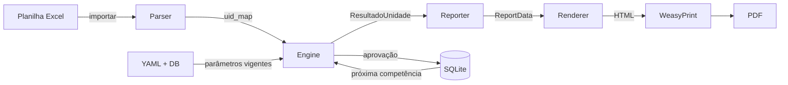
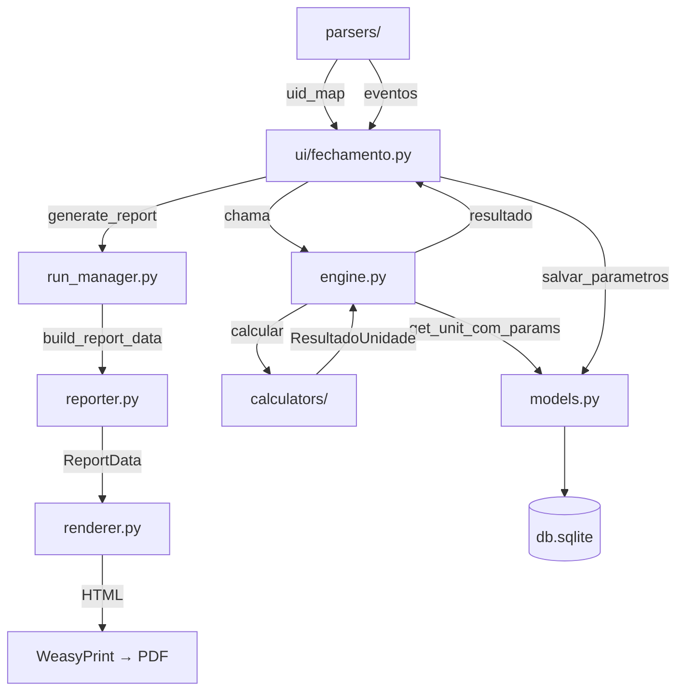
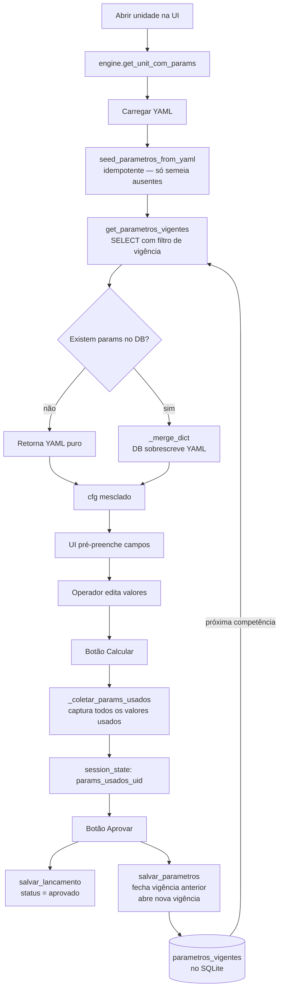
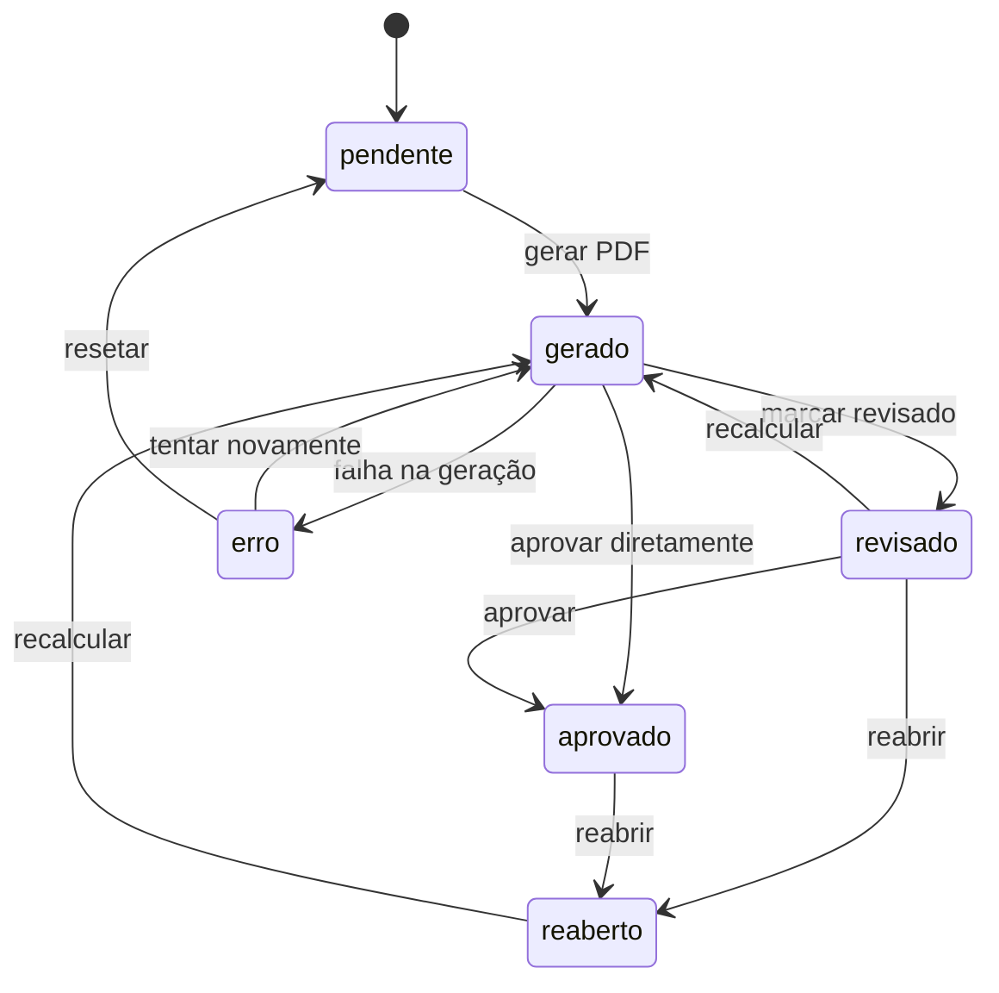
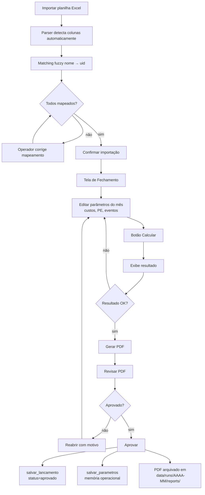

# Arquitetura v1.0 — Lyon Park Estacionamentos
> Documento de referência técnica. Descreve a arquitetura do sistema de geração de relatórios mensais de prestação de contas.
> **Data de congelamento:** julho/2026

---

## Sumário

1. [Visão Geral](#1-visão-geral)
2. [Arquitetura do Projeto](#2-arquitetura-do-projeto)
3. [Calculadores Existentes](#3-calculadores-existentes)
4. [Estrutura dos Parâmetros](#4-estrutura-dos-parâmetros)
5. [Fluxo dos Parâmetros](#5-fluxo-dos-parâmetros)
6. [Estrutura do Banco de Dados](#6-estrutura-do-banco-de-dados)
7. [Workflow do Fechamento](#7-workflow-do-fechamento)
8. [Compatibilidade](#8-compatibilidade)
9. [Decisões de Arquitetura](#9-decisões-de-arquitetura)
10. [Próximas Etapas](#10-próximas-etapas)

---

## 1. Visão Geral

O sistema é uma aplicação Python/Streamlit que realiza o fechamento mensal de 23 unidades de estacionamento gerenciadas pela Lyon Park. A cada competência (mês/ano), o operador:

1. **Importa** a planilha de faturamento mensal (Excel)
2. **Confere** o mapeamento automático de nomes da planilha para unidades do sistema
3. **Edita** parâmetros variáveis do mês (custos, ponto de equilíbrio, eventos)
4. **Calcula** o resultado e o aluguel de cada unidade
5. **Aprova** o relatório, persistindo os parâmetros utilizados como nova configuração vigente
6. **Gera** o PDF de prestação de contas para envio ao contratante



### Conceitos-chave

| Conceito | Descrição |
|---|---|
| **Competência** | Mês de referência no formato `AAAA-MM` (ex: `2026-06`) |
| **Unidade** | Estacionamento com configuração própria, identificada por `uid` |
| **Parâmetro vigente** | Valor operacional com intervalo de validade por competência |
| **Memória operacional** | Valores aprovados num mês tornam-se padrão no mês seguinte |

---

## 2. Arquitetura do Projeto

### Estrutura de módulos

```
lyon-reports/
├── main.py                     # Entrada da aplicação Streamlit
├── data/
│   ├── units.yaml              # Configuração estrutural de todas as unidades
│   ├── db.sqlite               # Banco de dados operacional
│   └── runs/
│       └── {AAAA-MM}/
│           ├── status.json     # Status do workflow por unidade
│           ├── input/          # Arquivos originais importados
│           ├── processed/      # JSON processado (faturamento, eventos)
│           └── reports/        # PDFs gerados
├── app/
│   ├── engine.py               # Orquestrador de cálculo
│   ├── models.py               # Camada de persistência (SQLite) e tipos de dados
│   ├── reporter.py             # Montagem do objeto ReportData
│   ├── report_data.py          # Dataclasses do relatório (contrato com o template)
│   ├── renderer.py             # ReportData → HTML → PDF (WeasyPrint)
│   ├── run_manager.py          # Workflow e versionamento de PDFs
│   ├── relatorio.py            # Histórico anual e comparativo
│   ├── calculators/
│   │   ├── base.py             # PERCENTUAL_SIMPLES, COM_ALIQUOTA
│   │   ├── cumulativo.py       # COM_ALIQUOTA_CUMUL
│   │   ├── faixas.py           # COM_FAIXAS
│   │   ├── split.py            # COM_ALIQUOTA_SPLIT
│   │   ├── resultado_split.py  # RESULTADO_SPLIT
│   │   ├── repasse_duplo.py    # COM_ALIQUOTA_REPASSE_DUPLO
│   │   ├── patio.py            # PATIO_OPERACAO
│   │   └── patio_manutencao.py # PATIO_MANUTENCAO
│   ├── parsers/
│   │   ├── faturamento.py      # Parser da planilha de faturamentos
│   │   └── eventos.py          # Parser da planilha de eventos (MDO)
│   └── ui/
│       ├── entrada.py          # Tela de importação da planilha
│       ├── fechamento.py       # Tela principal de cálculo e aprovação
│       ├── revisao.py          # Tela de revisão dos relatórios
│       └── relatorios.py       # Tela de histórico e download
└── templates/
    ├── relatorio.html          # Template Jinja2 do relatório PDF
    └── report.css              # Estilos do relatório (formato A4)
```

### Relação entre módulos



---

## 3. Calculadores Existentes

Todos os calculadores recebem `(cfg, mes, faturamento, **kwargs)` e retornam `ResultadoUnidade`. A seleção do calculador ocorre em `engine.py:calcular()` com base no campo `tipo_calculo` do YAML.

---

### 3.1 PERCENTUAL_SIMPLES

**Arquivo:** `app/calculators/base.py`  
**Unidades:** Vasco da Gama

**Finalidade:** Contrato simples sem alíquota de imposto. O aluguel é um percentual do resultado após dedução do ponto de equilíbrio. Quando o resultado é negativo, cobra uma taxa de administração fixa.

**Parâmetros:**
| Parâmetro | Tipo | Descrição |
|---|---|---|
| `ponto_equilibrio` | moeda | Valor mínimo de faturamento para gerar aluguel |
| `percentual_aluguel` | percentual | Alíquota aplicada sobre o resultado positivo |
| `taxa_admin_fixa` | moeda | Valor cobrado quando resultado ≤ 0 |

**Fluxo:**
```
resultado_bruto = faturamento - ponto_equilibrio
se resultado_bruto > 0:
    aluguel = resultado_bruto × percentual_aluguel
senão:
    aluguel = 0
    cobra taxa_admin_fixa (se configurado)
```

---

### 3.2 COM_ALIQUOTA

**Arquivo:** `app/calculators/base.py`  
**Unidades:** Anitta Mall, FK Moinhos, FK Rosário

**Finalidade:** Cálculo com desconto de alíquota de imposto antes de aplicar o ponto de equilíbrio. Suporta dedução de investimentos do aluguel (saldo a pagar).

**Parâmetros:**
| Parâmetro | Tipo | Descrição |
|---|---|---|
| `ponto_equilibrio` | moeda | Ponto de equilíbrio contratual |
| `aliquota_imposto` | percentual | Alíquota deduzida do faturamento bruto |
| `percentual_aluguel` | percentual | Percentual aplicado sobre o resultado |
| `custos_variaveis.investimentos` | moeda | Deduzido do aluguel → saldo a pagar |

**Fluxo:**
```
subtotal = faturamento × (1 - aliquota_imposto)
resultado = max(subtotal - ponto_equilibrio, 0)
aluguel = resultado × percentual_aluguel
saldo_a_pagar = aluguel - investimentos  (se houver)
```

---

### 3.3 COM_ALIQUOTA_CUMUL

**Arquivo:** `app/calculators/cumulativo.py`  
**Unidades:** A. Schneider, Dom Pedro, ILP, In 1183, MW Tristeza, Parking 1, Viva Trindade, W Tower

**Finalidade:** Calculadora mais completa do sistema. Acumula prejuízo entre meses — quando o resultado é negativo, o saldo devedor é carregado para a próxima competência. Suporta custos mensais fixos, faixas de aluguel progressivas, fundo de recomposição e adicional fixo.

**Parâmetros:**
| Parâmetro | Tipo | Descrição |
|---|---|---|
| `ponto_equilibrio` | moeda | Ponto de equilíbrio contratual |
| `aliquota_imposto` | percentual | Alíquota de imposto |
| `percentual_aluguel` | percentual | Percentual base (quando não há faixas) |
| `taxa_admin_fixa` | moeda | Taxa mínima garantida |
| `custos_mensais.*` | moeda | Custos fixos deduzidos mensalmente |
| `custos_variaveis.investimentos` | moeda | Deduzido do aluguel → saldo a pagar |
| `custos_variaveis.fundo_recomposicao` | moeda | Deduzido do aluguel → saldo a pagar |
| `faixas_aluguel` | json | Faixas progressivas sobre o resultado acumulado |
| `adicional_fixo` | moeda | Parcela fixa somada ao aluguel |

**Fluxo:**
```
subtotal = (faturamento + fat_carregadores) × (1 - aliquota)
custos_total = soma(custos_mensais)
resultado_bruto = subtotal - ponto_equilibrio - custos_total
resultado_com_saldo = resultado_bruto + prejuizo_acumulado_entrada

se resultado_com_saldo > 0:
    aluguel = aplicar_faixas(resultado_com_saldo)  ou  resultado × pct
    aluguel = max(aluguel, taxa_admin_fixa)
    prejuizo_acumulado_saida = 0
senão:
    aluguel = 0
    prejuizo_acumulado_saida = resultado_com_saldo  ← carregado para o próximo mês
```

> **MW Tristeza:** possui flag `prejuizo_correcao_anual: IPCA`. Em janeiro, o operador informa o IPCA do ano anterior e o sistema aplica `corrigir_saldo_anual()` que multiplica o saldo devedor por `(1 + ipca)`.

---

### 3.4 COM_FAIXAS

**Arquivo:** `app/calculators/faixas.py`  
**Unidades:** Ekos, Fiergs, Monza, NL 2800, OKA

**Finalidade:** Calcula o aluguel aplicando alíquotas progressivas por faixas de resultado. Cada faixa é aplicada sobre uma **fatia** do resultado (semântica de largura), não sobre o total acumulado.

**Parâmetros:**
| Parâmetro | Tipo | Descrição |
|---|---|---|
| `faixas` | json | Lista `[{ate, percentual}]` — `ate: null` = faixa aberta |
| `ponto_equilibrio` | moeda | Deduzido antes das faixas |
| `aliquota_imposto` | percentual | Alíquota sobre faturamento |
| `taxa_cobranca` | percentual | Custo de cobrança deduzido |
| `custos_mensais.*` | moeda | Custos fixos mensais |
| `custos_variaveis.*` | moeda | Custos variáveis mensais |

**Fluxo:**
```
taxa_cob_valor = base_taxa_cobranca × taxa_cobranca
subtotal = faturamento × (1 - aliquota) - taxa_cob_valor
resultado = subtotal - ponto_equilibrio - custos_total

aluguel = 0
saldo = resultado
para cada faixa:
    parcela = min(saldo, faixa.ate)   # largura da faixa, não limite absoluto
    aluguel += parcela × faixa.percentual
    saldo -= parcela
```

> **NL 2800:** faixas com `ate: 45000`, `ate: 50000`, `ate: null` significam "primeiros R$ 45k", "próximos R$ 50k", "restante" — não limites absolutos de 45k e 95k.

---

### 3.5 COM_ALIQUOTA_SPLIT

**Arquivo:** `app/calculators/split.py`  
**Unidades:** Axis

**Finalidade:** O resultado é dividido em partes (splits) com percentuais de receita distintos. Cada parte tem sua própria alíquota de aluguel.

**Parâmetros:**
| Parâmetro | Tipo | Descrição |
|---|---|---|
| `ponto_equilibrio` | moeda | Ponto de equilíbrio global |
| `aliquota_imposto` | percentual | Alíquota sobre faturamento |
| `splits` | json | `[{id, nome, percentual_split, percentual_aluguel}]` |

**Fluxo:**
```
subtotal = faturamento × (1 - aliquota)
resultado = max(subtotal - ponto_equilibrio, 0)

para cada split:
    base_split = resultado × split.percentual_split
    aluguel_split = base_split × split.percentual_aluguel

aluguel_total = soma(aluguel_split)
```

---

### 3.6 RESULTADO_SPLIT

**Arquivo:** `app/calculators/resultado_split.py`  
**Unidades:** Medcenter, Viva Open Mall

**Finalidade:** O operador e o contratante dividem o resultado líquido em percentuais contratuais. O contratante recebe sua parcela menos uma parcela fixa mensal já paga (aluguel garantido).

**Parâmetros:**
| Parâmetro | Tipo | Descrição |
|---|---|---|
| `aliquota_imposto` | percentual | Alíquota sobre receita bruta |
| `despesas_fixas` | moeda | Custos de operação do contrato |
| `percentual_operador` | percentual | Parcela do resultado do operador |
| `percentual_contratante` | percentual | Parcela do resultado do contratante |
| `parcela_fixa` | moeda | Valor já pago antecipadamente |
| `custos_mensais.*` | moeda | Custos fixos variáveis do mês |

**Fluxo:**
```
receita_liquida = faturamento × (1 - aliquota)
custos_total = despesas_fixas + custos_mensais + custos_variaveis
resultado = receita_liquida - custos_total

resultado_operador    = resultado × percentual_operador
resultado_contratante = resultado × percentual_contratante
saldo_a_pagar = resultado_contratante - parcela_fixa
```

---

### 3.7 COM_ALIQUOTA_REPASSE_DUPLO

**Arquivo:** `app/calculators/repasse_duplo.py`  
**Unidades:** Terreno OKA

**Finalidade:** O resultado é distribuído para múltiplos beneficiários (locadora, administradora) com percentuais e valores mínimos garantidos individuais.

**Parâmetros:**
| Parâmetro | Tipo | Descrição |
|---|---|---|
| `ponto_equilibrio` | moeda | Ponto de equilíbrio |
| `aliquota_imposto` | percentual | Alíquota sobre faturamento |
| `taxa_cobranca` | percentual | Taxa de cobrança |
| `repasses` | json | `[{id, nome, percentual, aluguel_minimo}]` |
| `custos_mensais.*` | moeda | Custos mensais |

**Fluxo:**
```
subtotal = faturamento × (1 - aliquota) - taxa_cobranca_valor
resultado = subtotal - ponto_equilibrio - custos_total

para cada repasse:
    se resultado > 0:
        valor = max(resultado × percentual, aluguel_minimo)
    senão:
        valor = aluguel_minimo

total_repasse = soma(valores)
```

---

### 3.8 PATIO_OPERACAO

**Arquivo:** `app/calculators/patio.py`  
**Unidades:** Pátio Pellegrin (virtual — gera dois sub-relatórios: Real e Maiojama)

**Finalidade:** Contrato de co-gestão. O faturamento é dividido entre dois operadores (splits configuráveis). Cada operador tem PE, custos mensais e percentual de aluguel independentes. Inclui receitas extras de outros serviços (mídias), carregadores elétricos e manutenção.

**Parâmetros:**
| Parâmetro | Tipo | Descrição |
|---|---|---|
| `aliquota_imposto` | percentual | Alíquota compartilhada |
| `splits[].percentual_split` | percentual | Fração do faturamento de cada operador |
| `splits[].ponto_equilibrio` | moeda | PE individual por operador |
| `splits[].percentual_aluguel` | percentual | Alíquota individual por operador |
| `splits[].custos_mensais.*` | moeda | Custos mensais por operador |
| `outros_servicos.percentual_repasse` | percentual | Repasse de mídias |
| `carregadores.taxa_intermediacao_weg` | percentual | Taxa WEG |
| `carregadores.percentual_repasse` | percentual | Repasse de carregadores |

**Fluxo:**
```
para cada operador (Real, Maiojama):
    fat_operador = fat_total × percentual_split
    subtotal = fat_operador × (1 - aliquota)
    resultado = max(subtotal - PE - custos_mensais, 0)
    aluguel = resultado × percentual_aluguel

outros_serviços → split por percentual entre operadores
carregadores → saldo acumulado, taxa WEG, split
manutenção → retenção ISS, custos, saldo acumulado
```

---

### 3.9 PATIO_MANUTENCAO

**Arquivo:** `app/calculators/patio_manutencao.py`  
**Unidades:** Pátio Pellegrin Manutenção (separado)

**Finalidade:** Controla a receita e os custos de manutenção do Pátio como uma unidade independente. Acumula saldo entre meses via `saldos_acumulados`.

**Parâmetros:**
| Parâmetro | Tipo | Descrição |
|---|---|---|
| `retencao_iss` | percentual | Retenção de ISS sobre receita |
| `custos_mensais.*` | moeda | Custos mensais fixos |

**Fluxo:**
```
retencao_iss = faturamento × retencao_iss_pct
subtotal = faturamento - retencao_iss
resultado = subtotal - custos_mensais
saldo_acumulado = saldo_anterior + resultado   ← persiste no DB
```

---

## 4. Estrutura dos Parâmetros

### O que permanece no YAML

O YAML (`data/units.yaml`) contém exclusivamente **configuração estrutural** — campos que definem o tipo de contrato e que raramente mudam. Alterar esses campos implica alterar o código-fonte.

| Campo | Tipo | Motivo de permanecer no YAML |
|---|---|---|
| `id`, `nome`, `contratante` | identidade | Identidade do contrato |
| `ativo`, `inicio` | ciclo de vida | Estado administrativo |
| `tipo_calculo` | código | Seleciona a calculadora — muda com alteração de código |
| `tipo_relatorio`, `relatorio`, `pdfs`, `linhas` | template | Define layout do PDF |
| `outros_servicos`, `carregadores`, `manutencao` | estrutura | Blocos do Pátio com sub-estrutura complexa |
| `pagamento_parcelado` | legado | Estrutura de parcelas fixas (Medcenter antigo) |
| `tem_*`, `has_*` | flags | Controlam comportamento das calculadoras |
| `prejuizo_correcao_anual` | flag | Indica correção anual do saldo |

### O que vai para o banco de dados

Todos os **valores operacionais** — aqueles que podem mudar mês a mês ou ser editados pelo operador — são persistidos no banco.

| Categoria | Exemplos |
|---|---|
| Ponto de equilíbrio | `ponto_equilibrio` |
| Alíquotas | `aliquota_imposto` |
| Percentuais | `percentual_aluguel`, `percentual_operador`, `percentual_contratante` |
| Taxas e parcelas fixas | `taxa_admin_fixa`, `parcela_fixa`, `despesas_fixas` |
| Custos fixos mensais | `custos_mensais.condominio`, `custos_mensais.iptu`, `custos_mensais.agua` |
| Custos variáveis | `custos_variaveis.investimentos`, `custos_variaveis.fundo_recomposicao` |
| Reajuste | `reajuste_mes`, `reajuste_indice` |
| Faixas e splits | `faixas`, `faixas_aluguel`, `splits`, `repasses` |

### Vigência por competência

Cada parâmetro tem um **intervalo de validade** `[competencia_inicio, competencia_fim]`. Quando um valor é alterado ao aprovar um relatório:

1. A linha anterior recebe `competencia_fim = mês anterior`
2. Uma nova linha é inserida com `competencia_inicio = mês corrente`

Isso preserva o histórico completo: é possível regenerar qualquer relatório passado com os exatos parâmetros vigentes naquele momento.

### Memória operacional

Ao aprovar um relatório, o sistema persiste automaticamente todos os parâmetros utilizados naquele cálculo. Na próxima competência, esses valores são carregados como padrão — sem necessidade de redigitar. O operador só precisa alterar o que realmente mudou.

---

## 5. Fluxo dos Parâmetros



---

## 6. Estrutura do Banco de Dados

### Tabela `lancamentos`

Armazena o resultado calculado de cada unidade por competência.

| Campo | Tipo | Descrição |
|---|---|---|
| `id` | INTEGER PK | Identificador interno |
| `unidade_id` | TEXT | UID da unidade (ex: `mw_tristeza`) |
| `mes_referencia` | TEXT | Competência no formato `AAAA-MM` |
| `faturamento` | REAL | Faturamento informado |
| `resultado_json` | TEXT | Serialização completa do `ResultadoUnidade` |
| `status` | TEXT | `rascunho` \| `aprovado` |
| `criado_em` | TEXT | Timestamp de criação |

**Restrição:** `UNIQUE(unidade_id, mes_referencia)` — um lançamento por unidade por mês, atualizado por upsert.

---

### Tabela `saldos_acumulados`

Persiste o saldo de prejuízo acumulado entre competências (usado por `COM_ALIQUOTA_CUMUL` e `PATIO_MANUTENCAO`).

| Campo | Tipo | Descrição |
|---|---|---|
| `unidade_id` | TEXT PK | UID da unidade |
| `prejuizo_acumulado` | REAL | Saldo atual (negativo = prejuízo) |
| `atualizado_em` | TEXT | Data da última atualização |

---

### Tabela `historico_anual`

Armazena dados históricos anuais para o bloco de histórico do relatório PDF.

| Campo | Tipo | Descrição |
|---|---|---|
| `id` | INTEGER PK | Identificador interno |
| `unidade_id` | TEXT | UID da unidade |
| `ano` | INTEGER | Ano de referência |
| `dados_json` | TEXT | Indicadores anuais serializados |

---

### Tabela `parametros_vigentes` ⭐

Núcleo da arquitetura de parametrização. Armazena todos os parâmetros operacionais com trilha de auditoria completa.

| Campo | Tipo | Descrição |
|---|---|---|
| `id` | INTEGER PK | Identificador interno |
| `unidade_id` | TEXT | UID da unidade |
| `parametro` | TEXT | Nome em dot-notation (ex: `custos_mensais.condominio`) |
| `valor` | TEXT | Valor serializado em JSON |
| `tipo_dado` | TEXT | Tipo do dado para a UI: `moeda`, `percentual`, `inteiro`, `decimal`, `boolean`, `texto`, `json` |
| `descricao` | TEXT | Rótulo amigável (ex: `Condomínio`) |
| `competencia_inicio` | TEXT | Início da vigência (`AAAA-MM`) |
| `competencia_fim` | TEXT | Fim da vigência (`AAAA-MM`), `NULL` = ainda vigente |
| `alterado_em` | TEXT | Timestamp da alteração |
| `alterado_por` | TEXT | Responsável: `seed_yaml`, `operador`, `aprovacao`, `sistema` |

**Índice:** `(unidade_id, parametro, competencia_inicio)` — otimiza a query de vigência.

#### Exemplo de vigência

| unidade_id | parametro | valor | competencia_inicio | competencia_fim | alterado_por |
|---|---|---|---|---|---|
| `mw_tristeza` | `ponto_equilibrio` | `20681.99` | `2020-01` | `2026-05` | `seed_yaml` |
| `mw_tristeza` | `ponto_equilibrio` | `21200.00` | `2026-06` | `NULL` | `aprovacao` |

A query de vigência usa:
```sql
WHERE unidade_id = ?
  AND competencia_inicio <= ?   -- início ≤ mês consultado
  AND (competencia_fim IS NULL OR competencia_fim >= ?)  -- ainda vigente naquele mês
ORDER BY competencia_inicio DESC
```

#### Campo `tipo_dado`

Permite que a futura UI construa automaticamente o componente de edição correto:

| `tipo_dado` | Componente esperado |
|---|---|
| `moeda` | Campo numérico com máscara R$ |
| `percentual` | Campo numérico com sufixo % |
| `inteiro` | Campo numérico inteiro |
| `decimal` | Campo numérico decimal genérico |
| `boolean` | Checkbox |
| `texto` | Campo de texto livre |
| `json` | Tabela editável (faixas, splits, repasses) |
| `data` | Seletor de data |

---

## 7. Workflow do Fechamento

### Estados possíveis



### Fluxo operacional completo



### Versionamento de PDFs

Quando um relatório já aprovado ou revisado é recalculado, o PDF existente é automaticamente arquivado em `data/runs/{mes_ref}/reports/versions/` com timestamp antes da nova geração. O histórico de versões fica registrado no `status.json`.

---

## 8. Compatibilidade

### Fallback para YAML

O banco de dados **não é obrigatório** para o sistema funcionar. A função `get_unit_com_params()` opera em três modos:

1. **Sem DB:** retorna o YAML puro — comportamento idêntico ao sistema original
2. **DB parcial:** parâmetros ausentes no DB continuam vindo do YAML
3. **DB completo:** todos os parâmetros vêm do DB, YAML é ignorado nos campos operacionais

```python
db_params = get_parametros_vigentes(unidade_id, mes_ref)
if not db_params:
    return yaml_cfg          # modo 1: YAML puro
cfg = copy.deepcopy(yaml_cfg)
_merge_dict(cfg, db_params)  # modos 2 e 3: merge seletivo
return cfg
```

### Seed idempotente

`seed_parametros_from_yaml()` é chamada automaticamente na primeira `get_unit_com_params()` de cada unidade. Ela:

1. Lê todos os parâmetros já existentes no DB para aquela unidade
2. Semeia apenas os que ainda não existem
3. Nunca sobrescreve dados já gravados

Isso permite adicionar novos tipos de parâmetros ao sistema sem risco de sobrescrever valores editados pelo operador.

### Compatibilidade com bases antigas

Para DBs criados antes da adição das colunas `tipo_dado` e `descricao`, o `init_db()` executa migration automática:

```python
for col in ("tipo_dado TEXT", "descricao TEXT"):
    try:
        conn.execute(f"ALTER TABLE parametros_vigentes ADD COLUMN {col}")
    except sqlite3.OperationalError:
        pass  # coluna já existe
```

### Comportamento com parâmetro ausente no DB

Quando um parâmetro não está mapeado em `_PARAM_META`, a função `_infer_meta()` determina automaticamente o `tipo_dado` pelo tipo Python do valor:

| Tipo Python | `tipo_dado` inferido |
|---|---|
| `list` | `json` |
| `bool` | `boolean` |
| `int` | `inteiro` |
| `float` | `decimal` |
| `str` | `texto` |

---

## 9. Decisões de Arquitetura

### 9.1 Separação entre configuração estrutural e estado operacional

**Decisão:** O YAML contém apenas o que nunca muda operacionalmente. O DB contém tudo que o operador pode precisar ajustar.

**Motivo:** Antes desta separação, qualquer ajuste de valor exigia edição manual do YAML — operação propensa a erros e sem trilha de auditoria. A separação permite que o operador ajuste parâmetros via UI com histórico completo, enquanto mudanças contratuais reais (novo tipo de cálculo, novo template) permanecem sob controle do desenvolvedor.

---

### 9.2 Parâmetros persistidos por competência com vigência

**Decisão:** Cada valor tem intervalo `[inicio, fim]` em vez de sobrescrever o valor anterior.

**Motivo:** Relatórios já aprovados precisam ser regenerados com os exatos valores vigentes na época. Um upsert simples impossibilitaria isso. Com a tabela de vigências, qualquer competência passada pode ser reconstruída fielmente.

---

### 9.3 Memória operacional automática na aprovação

**Decisão:** Ao aprovar um relatório, todos os parâmetros utilizados naquele cálculo são automaticamente persistidos como nova vigência.

**Motivo:** O operador não deve precisar "confirmar" parâmetros que não mudaram. O fluxo natural é: edita só o que mudou → calcula → aprova. O sistema registra o estado completo, não apenas os deltas.

---

### 9.4 YAML como fallback, não como fonte de verdade

**Decisão:** O DB tem precedência sobre o YAML para parâmetros operacionais.

**Motivo:** Permite migração gradual — unidades sem histórico no DB continuam funcionando com o YAML original. O YAML deixa de ser o "arquivo de configuração que o operador edita" e passa a ser o "ponto de partida histórico".

---

### 9.5 Calculadores genéricos parametrizados

**Decisão:** Cada tipo de calculadora lê todos os seus parâmetros do `cfg` dict. Não existem valores hardcoded nos calculadores.

**Motivo:** O mesmo calculador serve para múltiplas unidades com contratos diferentes. Adicionar uma nova unidade com o mesmo tipo de cálculo requer apenas adicionar uma entrada no YAML — sem alterar código.

---

### 9.6 Interface futura baseada em metadados

**Decisão:** A tabela `parametros_vigentes` armazena `tipo_dado` e `descricao` junto com o valor.

**Motivo:** A tela de edição de parâmetros deve ser construída inteiramente a partir dos dados do banco, sem nenhum mapeamento manual no código. O `tipo_dado` informa qual componente de UI usar; a `descricao` informa o rótulo a exibir. Adicionar um novo parâmetro ao sistema automaticamente o tornará editável na UI, sem nenhuma alteração de código de interface.

---

### 9.7 `ResultadoUnidade` como contrato interno

**Decisão:** Todos os calculadores retornam `ResultadoUnidade`. O reporter consome apenas esse objeto, nunca o `cfg` diretamente.

**Motivo:** Isola as calculadoras do sistema de relatórios. É possível alterar a lógica de cálculo sem afetar o template, e vice-versa. O campo `extras` do `ResultadoUnidade` permite que calculadoras específicas passem dados adicionais para o relatório sem quebrar a interface.

---

### 9.8 `ReportData` como contrato com o template

**Decisão:** O template HTML/Jinja2 recebe apenas um objeto `ReportData`. Não conhece `ResultadoUnidade`, `cfg`, nem o banco de dados.

**Motivo:** Mantém o template puramente declarativo. O `reporter.py` é o único ponto de tradução entre o domínio de cálculo e o domínio de apresentação. Alterar o template não requer conhecimento das regras de negócio.

---

### 9.9 Parser com matching fuzzy

**Decisão:** O mapeamento de nomes da planilha para UIDs usa score de Jaccard sobre palavras normalizadas (sem acentos, sem pontuação).

**Motivo:** Os nomes na planilha de faturamento do cliente raramente coincidem exatamente com os nomes cadastrados no sistema. O matching fuzzy elimina trabalho manual na maioria dos meses, exigindo intervenção do operador apenas para casos ambíguos.

---

## 10. Próximas Etapas

As fases abaixo estão previstas para desenvolvimento futuro. Esta seção registra a intenção, não o escopo detalhado.

### 10.1 Tela de Parametrização

Construção da interface de edição de parâmetros por unidade e por competência, aproveitando os metadados `tipo_dado` e `descricao` já armazenados no banco. A UI deverá:

- Listar todos os parâmetros vigentes de uma unidade
- Permitir edição com o componente adequado ao tipo (`moeda`, `percentual`, `json` → tabela)
- Exibir histórico de alterações por parâmetro
- Registrar quem alterou e quando

### 10.2 Workflow de Aprovação Aprimorado

Melhorias no fluxo de aprovação:

- Comentários e justificativas obrigatórias ao reabrir
- Notificações (email ou Slack) ao aprovar/reabrir
- Comparativo automático entre o cálculo atual e o mês anterior
- Alerta quando um parâmetro difere significativamente do histórico

### 10.3 Melhorias dos Relatórios

- Variação percentual mês a mês no bloco de comparativo
- Gráfico de evolução anual do faturamento e aluguel
- Nota de rodapé com memória de cálculo completa
- Versão compactada do PDF para envio por e-mail

### 10.4 Novas Unidades

O sistema foi projetado para receber novas unidades apenas com adição de entrada no YAML (sem alteração de código), desde que o tipo de cálculo já exista. Unidades com contratos novos podem exigir novo tipo de calculadora.

### 10.5 Otimizações e Qualidade

- Testes automatizados por calculadora com fixtures das Memórias de Cálculo aprovadas
- Cache de parâmetros vigentes em memória (evitar query a cada `get_unit_com_params`)
- Exportação do histórico de parâmetros para CSV/Excel
- Backup automático do `db.sqlite` antes de cada competência

### 10.6 Autenticação e Multi-usuário

- Login com perfis: `operador` (edita e calcula), `revisor` (aprova), `admin` (parametriza)
- Trilha de auditoria vinculada ao usuário logado (campo `alterado_por`)
- Controle de acesso por unidade

---

*Documento gerado em julho/2026. Para dúvidas sobre a arquitetura, consultar o histórico do projeto ou contatar o time de desenvolvimento.*
