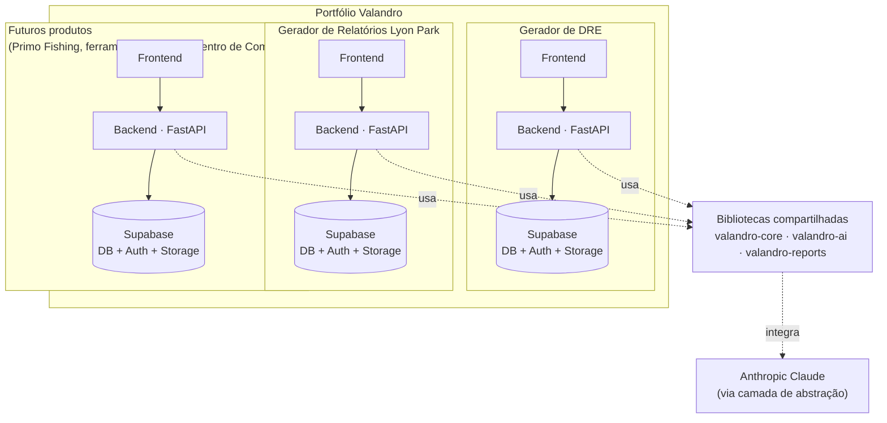
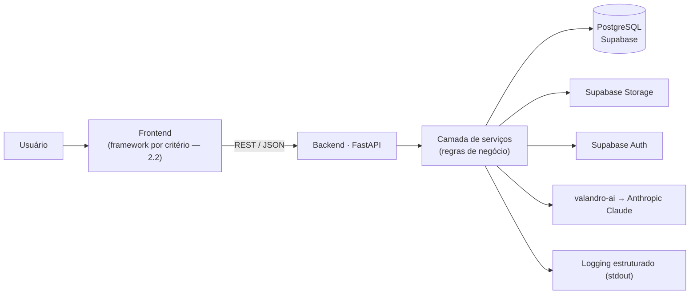
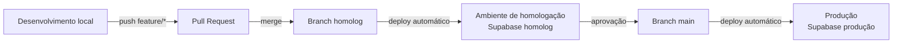
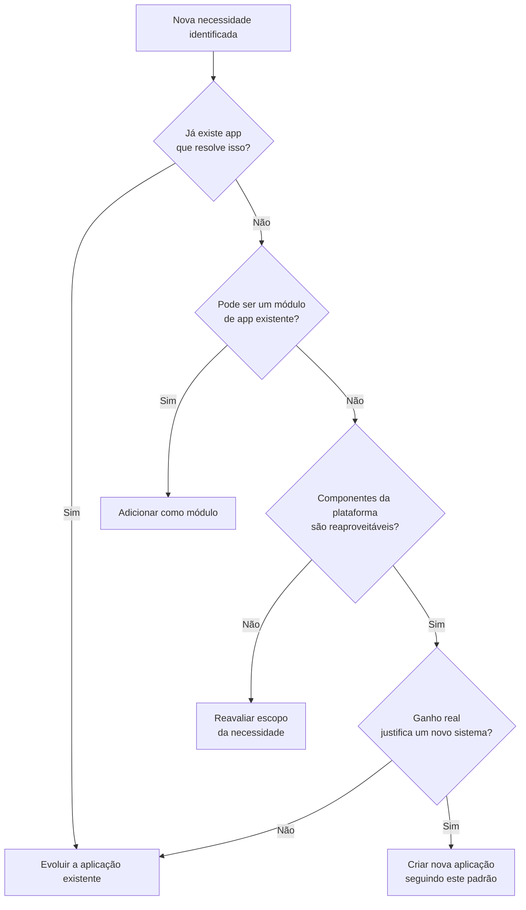
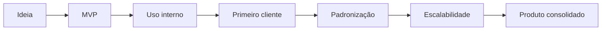
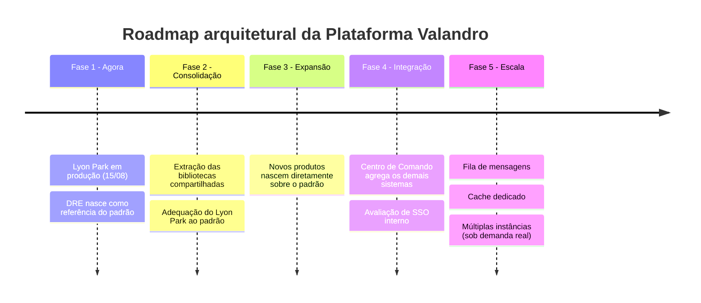

# PADRÃO TECNOLÓGICO VALANDRO

**Versão:** 1.0
**Status:** Aprovado — referência oficial da Plataforma Valandro
**Data de aprovação:** 10/08/2026
**Autor:** Arquitetura de Software Valandro (documento vivo — atualizado a cada decisão relevante)
**Aplica-se a:** todas as aplicações desenvolvidas pela Valandro Gestão, atuais e futuras.

---

## Sumário

1. [Filosofia e princípios arquiteturais](#1-filosofia-e-princípios-arquiteturais)
2. [Stack tecnológica padrão](#2-stack-tecnológica-padrão)
3. [Estrutura padrão de projetos](#3-estrutura-padrão-de-projetos)
4. [Organização de pastas](#4-organização-de-pastas)
5. [Convenções de nomenclatura](#5-convenções-de-nomenclatura)
6. [Banco de dados](#6-banco-de-dados)
7. [Armazenamento de arquivos](#7-armazenamento-de-arquivos)
8. [Autenticação](#8-autenticação)
9. [Configuração por variáveis de ambiente](#9-configuração-por-variáveis-de-ambiente)
10. [Logs](#10-logs)
11. [Auditoria](#11-auditoria)
12. [Deploy](#12-deploy)
13. [Ambientes](#13-ambientes)
14. [Backup](#14-backup)
15. [Segurança](#15-segurança)
16. [Estratégia para automações futuras](#16-estratégia-para-automações-futuras)
17. [Estratégia para integração entre aplicações](#17-estratégia-para-integração-entre-aplicações)
18. [Boas práticas de desenvolvimento](#18-boas-práticas-de-desenvolvimento)
19. [Critérios para adoção de novas tecnologias](#19-critérios-para-adoção-de-novas-tecnologias)
20. [Critérios para criação de novas aplicações](#20-critérios-para-criação-de-novas-aplicações)
21. [Ciclo de vida dos produtos](#21-ciclo-de-vida-dos-produtos)
22. [Roadmap arquitetural da plataforma](#22-roadmap-arquitetural-da-plataforma)
23. [Glossário](#23-glossário)
- [Registro de decisões arquiteturais](#registro-de-decisões-arquiteturais)
- [Histórico de revisões](#histórico-de-revisões)

---

## Como ler este documento

Cada decisão é classificada em uma destas categorias:

- **[Obrigatório]** — padrão que toda aplicação nova deve seguir desde o início. Aplicações existentes migram de forma incremental.
- **[Recomendado]** — prática forte, com espaço para exceção justificada e registrada.
- **[Futuro]** — não implementar agora. Existe para não sermos pegos de surpresa quando a necessidade aparecer, e para que a decisão de hoje não feche essa porta.

Este documento **não define regras de negócio**. Ele define **como construímos software na Valandro**, não **o que cada sistema faz**. Regras de negócio, funcionalidades e decisões específicas de produto vivem na documentação de cada aplicação (`docs/ARQUITETURA.md` e `docs/DECISOES.md` de cada repositório), nunca aqui.

---

## 1. Filosofia e princípios arquiteturais

### 1.1 Princípio central: portfólio, não monólito nem sistemas isolados

> As decisões tecnológicas são pensadas para um **portfólio de aplicações**, não para um sistema isolado. Cada aplicação tem sua própria regra de negócio e seu próprio banco de dados — mas todas compartilham a mesma arquitetura, os mesmos padrões e a mesma forma de desenvolver. Não unificamos sistemas. Padronizamos a forma como eles são construídos.

Na prática: quem já sabe mexer em um sistema Valandro deve levar no máximo algumas horas para se orientar em qualquer outro.

### 1.2 A plataforma existe para acelerar, nunca para atrasar

> A plataforma existe para acelerar a entrega dos produtos, nunca para atrasá-los. Nenhuma decisão arquitetural deve impedir uma entrega importante do negócio. Quando houver conflito entre evolução arquitetural e entrega de valor ao cliente, a arquitetura evolui de forma incremental — preservando a continuidade do negócio.

Este é o critério de desempate sempre que uma decisão de arquitetura parecer entrar em conflito com um prazo real de negócio.

### 1.3 O que é compartilhado entre as aplicações — e o que não é

> As aplicações compartilham padrões e infraestrutura, mas não compartilham regras de negócio nem dados.

Cada sistema possui sua própria regra de negócio, seu próprio banco de dados e seu próprio armazenamento de arquivos. O compartilhamento entre aplicações Valandro acontece apenas naquilo que serve à plataforma como um todo:

- arquitetura;
- autenticação (quando aplicável);
- infraestrutura;
- padrões de desenvolvimento;
- processos de deploy;
- observabilidade;
- boas práticas.

O objetivo é manter independência real entre os produtos, evitando acoplamentos desnecessários entre sistemas que resolvem problemas diferentes.

### 1.4 Princípios operacionais

1. **Simplicidade operacional acima de tudo.** O time de desenvolvimento é uma pessoa, acelerada por IA. Qualquer decisão que exija administração ativa de infraestrutura (servidores, filas, clusters) só é aceitável quando o problema que ela resolve já existe de verdade — não antes.
2. **Evolução incremental.** Nunca reescrevemos um sistema por preferência estética ou porque "a tecnologia nova é melhor". Reescrevemos apenas quando a arquitetura atual impede fisicamente a evolução do negócio.
3. **Reutilização entre projetos.** Todo código que resolve um problema genérico (autenticação, geração de relatório, integração com IA, logging, auditoria) nasce pensado para virar biblioteca compartilhada, não para viver preso a um único projeto.
4. **Baixo custo operacional.** Preferimos pagar um pouco mais por serviços gerenciados a gastar tempo de desenvolvimento administrando infraestrutura. Tempo de desenvolvimento é o recurso mais escasso da empresa hoje.
5. **Escalabilidade gradual, nunca antecipada.** A arquitetura acompanha o crescimento real do negócio. Não construímos para 100 mil usuários quando temos 20. Toda decisão de escala tem um gatilho de dado real (volume, latência, custo) que a justifica — não uma suposição.
6. **Decisão técnica não é modismo.** Tecnologia nova só entra na stack padrão se resolver um problema real, tiver suporte de longo prazo e puder ser mantida por uma equipe pequena (critérios completos na seção 19).

### 1.5 Visão geral da arquitetura

Cada aplicação é uma unidade isolada (frontend + backend + projeto Supabase próprio), mas todas se apoiam nas mesmas bibliotecas e nos mesmos padrões da plataforma:



Cada bloco `Supabase` é um **projeto isolado por aplicação** — não um banco compartilhado. O que conecta os blocos é o uso das mesmas bibliotecas e dos mesmos padrões, não uma dependência de dados entre eles.

### 1.6 Nota prática: o prazo do Lyon Park

O Gerador de Relatórios Lyon Park entra em operação em **15/08/2026**. Isso é uma restrição real e deve ser respeitada: **o lançamento não deve ser bloqueado pela adequação total a este padrão.** Lyon Park entra em produção como está, e a adequação ao padrão (autenticação, storage, deploy, etc.) acontece de forma incremental depois — exatamente como o princípio de evolução incremental prevê. Forçar a adequação agora, sob pressão de prazo, é o tipo de complexidade antecipada que este documento existe para evitar — e é uma aplicação direta do princípio 1.2: a plataforma existe para acelerar entregas, nunca para atrasá-las.

O Gerador de DRE, por ser o produto mais estratégico e ainda em desenvolvimento ativo, é quem nasce já dentro do padrão e serve de referência viva para os próximos sistemas.

---

## 2. Stack tecnológica padrão

### 2.1 Tabela da stack

| Camada | Escolha | Classificação |
|---|---|---|
| Frontend | Definido por critério de uso, não por tecnologia única (ver 2.2) | Obrigatório (o critério) |
| Backend | Python + FastAPI + Pydantic | Obrigatório |
| Banco de dados | PostgreSQL gerenciado via Supabase | Obrigatório |
| Armazenamento de arquivos | Supabase Storage | Obrigatório |
| Autenticação | Supabase Auth | Obrigatório |
| Geração de arquivos (PDF/Excel) | Python: WeasyPrint/ReportLab (PDF), openpyxl (Excel) | Obrigatório |
| IA | Anthropic Claude via camada de abstração própria (`valandro-ai`) | Obrigatório (provedor) / Recomendado (abstração) |
| Automações/agendamento | Cron jobs e background workers da própria plataforma de deploy | Obrigatório |
| Hospedagem backend | Plataforma gerenciada que reduza administração de infraestrutura — referência atual: Render | Obrigatório (o critério) / Recomendado (o fornecedor) |
| Hospedagem frontend | Plataforma gerenciada equivalente — referência atual: Vercel | Obrigatório (o critério) / Recomendado (o fornecedor) |
| Versionamento | GitHub | Obrigatório |
| Migrations de banco | Alembic | Obrigatório |
| Fila de mensagens (Celery/Redis ou similar) | — | Futuro |

### 2.2 Critério de escolha de frontend

Não há tecnologia de frontend única obrigatória. Produtos diferentes do portfólio têm perfis de uso diferentes, e forçar a mesma tecnologia em todos eles criaria atrito sem ganho real. O que se mantém consistente entre aplicações não é o framework de UI — é a forma como o frontend se integra ao restante da plataforma: API REST, Supabase Auth, variáveis de ambiente, deploy automatizado.

| Perfil da aplicação | Frontend recomendado | Por quê |
|---|---|---|
| Ferramenta interna, analítica, dashboard de baixo tráfego, uso por poucas pessoas da equipe | Streamlit (ou equivalente), quando fizer sentido | Prioriza velocidade de entrega e menos código para manter, em troca de menor flexibilidade de UI — uma troca aceitável quando o público é interno e pequeno |
| Aplicação comercial, multiusuário, ou voltada ao cliente final | Framework web moderno (React/Next.js ou equivalente) | Necessário para UX rica, performance e capacidade de evolução de interface ao longo dos anos |

Independentemente da tecnologia escolhida, toda aplicação segue os mesmos padrões de integração definidos neste documento: comunicação com o backend via API REST, autenticação via Supabase Auth, configuração via variáveis de ambiente e deploy automatizado a partir do GitHub. A coerência da plataforma está nessa camada — não na tecnologia de UI em si.

### 2.3 Justificativa de cada decisão

**Backend — Python + FastAPI.**
Python é o padrão desejado e combina bem com o perfil dos produtos: geração de relatórios financeiros, análise de dados e integração com IA são pontos fortes do seu ecossistema (pandas, openpyxl, SDKs de IA). Entre os frameworks Python, FastAPI foi escolhido em vez de Django por ser mais leve operacionalmente (sem admin, ORM e convenções que não serão usadas), gerar documentação de API automaticamente (útil tanto para desenvolvimento manual quanto para acelerar integrações feitas por IA) e validar dados de forma explícita via Pydantic — o que reduz bugs silenciosos em relatórios financeiros, onde um erro de tipo pode virar um número errado no DRE de um cliente.

**Banco de dados, storage e autenticação — Supabase.**
Em vez de contratar três fornecedores diferentes (banco gerenciado, serviço de auth, storage de arquivos), Supabase entrega os três em uma única plataforma gerenciada, sobre PostgreSQL puro (sem lock-in de um banco proprietário). Isso reduz diretamente a complexidade operacional de uma equipe de uma pessoa: menos contas para administrar, menos integrações para manter, uma única fatura. Postgres puro por baixo também significa que, se um dia for necessário migrar para outro provedor de Postgres gerenciado, a mudança é tecnicamente simples.

*Isolamento entre aplicações:* cada aplicação tem seu **próprio projeto Supabase** (banco, auth e storage próprios). Isso não contradiz "autenticação centralizada" — centraliza-se a **tecnologia e o padrão de implementação**, não necessariamente os dados de usuários entre sistemas com públicos diferentes (clientes da Lyon Park não têm por que existir no mesmo banco de usuários de um futuro produto). A exceção prevista é uma futura identidade única para a **equipe interna** entre ferramentas internas (ver seção 22, Fase 4).

**Geração de arquivos — bibliotecas Python compartilhadas.**
Como Gerador de DRE e Gerador de Relatórios são, por natureza, sistemas que produzem documentos, a lógica de geração de PDF/Excel é escrita uma vez como biblioteca interna (`valandro-reports`) e reutilizada, em vez de reimplementada em cada projeto.

**IA — Anthropic Claude, com camada de abstração.**
A arquitetura não pode ficar acoplada a um único fornecedor de IA. A recomendação é usar a API da Anthropic como provedor padrão hoje, mas todo acesso a modelos de IA passa por uma biblioteca interna (`valandro-ai`) com interface própria — trocar de provedor no futuro (ou usar mais de um ao mesmo tempo, por exemplo um modelo mais barato para tarefas simples) exige mudar a implementação interna da biblioteca, não o código de cada aplicação.

**Hospedagem — critério, não fornecedor.**
O padrão da Valandro não é um fornecedor específico de hospedagem — é o critério: **utilizar uma plataforma de hospedagem gerenciada, que reduza a necessidade de administração de infraestrutura e permita evolução gradual da plataforma.** Render (backend) e Vercel (frontend) são a **referência atual** porque atendem muito bem a esse critério hoje: deploy contínuo a partir do GitHub, variáveis de ambiente, ambientes de preview e, no caso do Render, jobs agendados e workers em background — o que já deixa a porta aberta para automações futuras sem exigir infraestrutura própria. Essa escolha pode ser revista no futuro sem alterar o padrão arquitetural da Valandro: trocar de fornecedor de hospedagem é uma decisão operacional, não uma mudança de arquitetura. Toda menção a Render/Vercel no restante deste documento deve ser lida como a referência atual desse critério — não como exigência de fornecedor.

### 2.4 Arquitetura interna de uma aplicação

O fluxo abaixo é o mesmo para qualquer aplicação do portfólio, independentemente da tecnologia de frontend escolhida:



---

## 3. Estrutura padrão de projetos

Cada aplicação é um repositório próprio no GitHub, com backend e frontend no mesmo repositório (monorepo por aplicação — não confundir com monorepo entre aplicações, que não usamos):

```
valandro-<nome-do-produto>/
├── backend/
├── frontend/
├── docs/
│   ├── ARQUITETURA.md        # decisões específicas deste projeto
│   └── DECISOES.md           # registro de decisões locais (ADR simplificado)
├── .env.example
├── README.md
└── .github/workflows/        # pipelines de deploy/testes
```

Código genérico e reutilizável (auth helpers, geração de relatórios, wrapper de IA, logging, auditoria) não vive dentro de um projeto de aplicação — vive em repositórios de biblioteca compartilhada (ver seção 17).

---

## 4. Organização de pastas

**Backend (FastAPI):**
```
backend/
├── app/
│   ├── api/            # rotas/endpoints
│   ├── core/            # configuração, segurança, settings
│   ├── models/           # modelos de banco (SQLAlchemy)
│   ├── schemas/          # schemas Pydantic (entrada/saída da API)
│   ├── services/          # regras de negócio
│   ├── integrations/       # IA, storage, e-mail, integrações externas
│   └── workers/           # jobs agendados/background
├── migrations/            # Alembic
├── tests/
└── main.py
```

**Frontend (framework web — React/Next.js ou equivalente):**
```
frontend/
├── app/                # rotas (App Router)
├── components/
├── lib/                # clientes de API, utilitários
├── hooks/
└── styles/
```

> A estrutura acima se aplica quando o frontend escolhido, conforme o critério da seção 2.2, for um framework web moderno. Para aplicações internas/analíticas em Streamlit, a estrutura é mais simples — tipicamente um `app.py` de entrada e uma pasta `pages/` — e não precisa replicar esse padrão.

---

## 5. Convenções de nomenclatura

- **Repositórios:** `valandro-<produto>` (ex.: `valandro-dre`, `valandro-lyonpark`). Bibliotecas compartilhadas: `valandro-<funcao>` (ex.: `valandro-reports`, `valandro-ai`).
- **Branches:** `main` (produção), `homolog` (homologação), `feature/<nome>`, `fix/<nome>`.
- **Variáveis de ambiente:** `SCREAMING_SNAKE_CASE`, com prefixo do domínio quando aplicável (`DATABASE_URL`, `SUPABASE_URL`, `SUPABASE_SERVICE_KEY`, `ANTHROPIC_API_KEY`).
- **Tabelas de banco:** `snake_case`, plural (`clientes`, `lancamentos_dre`, `audit_log`).
- **Endpoints de API:** REST, versionados: `/api/v1/<recurso>`.
- **Commits:** convenção livre, mas recomenda-se prefixos simples (`feat:`, `fix:`, `chore:`, `docs:`) — ajuda a IA a gerar changelogs no futuro sem esforço extra.

---

## 6. Banco de dados

- **[Obrigatório]** PostgreSQL, um projeto Supabase por aplicação. Nada de banco compartilhado entre sistemas com regras de negócio diferentes.
- **[Obrigatório]** Alterações de schema **sempre** via migration (Alembic). Nunca alterar tabela manualmente em produção, nem por interface visual do Supabase.
- **[Obrigatório]** Toda tabela sensível (financeira, de auditoria) tem `created_at` e `updated_at`.
- **[Recomendado]** Nomear chaves estrangeiras de forma explícita (`cliente_id`, não `id_cliente` — padronizar sufixo `_id`).
- **[Futuro]** Réplicas de leitura ou particionamento — só quando volume de dados justificar; hoje nenhum sistema da Valandro está perto dessa necessidade.

---

## 7. Armazenamento de arquivos

- **[Obrigatório]** Supabase Storage, um bucket por aplicação, com subpastas por tipo de conteúdo (ex.: `relatorios/`, `anexos/`, `logos/`).
- **[Obrigatório]** Nenhum arquivo de produção fica salvo em disco local do servidor — servidores em plataformas gerenciadas não garantem persistência de disco entre deploys.
- **[Recomendado]** URLs de arquivos sensíveis são assinadas e com expiração curta, nunca públicas permanentes, mesmo que o arquivo em si não seja crítico.

---

## 8. Autenticação

- **[Obrigatório]** Supabase Auth como tecnologia padrão em toda aplicação nova.
- **[Obrigatório]** Cada aplicação mantém sua própria base de usuários (isolamento por padrão — ver justificativa em 2.3).
- **[Recomendado]** Autenticação multifator (MFA) obrigatória para qualquer conta com acesso administrativo (equipe Valandro), opcional para clientes finais.
- **[Futuro]** Identidade única (SSO) para a equipe interna da Valandro entre ferramentas internas (ex.: Centro de Comando). Não implementar antes de existir mais de uma ferramenta interna em uso simultâneo.

---

## 9. Configuração por variáveis de ambiente

- **[Obrigatório]** Toda configuração sensível (chaves de API, credenciais de banco, segredos) vem de variáveis de ambiente, nunca hardcoded no código.
- **[Obrigatório]** `.env` nunca é commitado no Git. Todo repositório tem um `.env.example` atualizado, com todas as variáveis necessárias e valores fictícios.
- **[Obrigatório]** Segredos de produção ficam apenas nas plataformas de deploy (hospedagem escolhida, Supabase), nunca em arquivos texto compartilhados por chat ou e-mail.

---

## 10. Logs

- **[Obrigatório]** Logging estruturado (formato JSON) escrito em stdout, aproveitando o sistema de logs nativo da plataforma de hospedagem — sem necessidade de ferramenta externa dedicada no estágio atual.
- **[Recomendado]** Todo request de API carrega um identificador de correlação (`request_id`) para facilitar rastrear um erro do frontend até o backend.
- **[Futuro]** Ferramenta dedicada de agregação de logs (ex.: Axiom, Better Stack) — adotar quando o volume de logs tornar a busca nativa das plataformas insuficiente, não antes.

---

## 11. Auditoria

- **[Obrigatório]** Toda aplicação que manipula dados financeiros ou dados de cliente sensíveis mantém uma tabela `audit_log` padrão, com no mínimo: usuário responsável, ação, entidade afetada, dados antes/depois (quando aplicável) e timestamp.
- **[Obrigatório]** Isso vale especialmente para o Gerador de DRE: qualquer alteração em lançamento financeiro deve ser rastreável — quem alterou, o quê e quando.
- **[Recomendado]** A gravação de auditoria acontece via uma função/serviço compartilhado (parte da biblioteca `valandro-core`), não reimplementada em cada projeto.

---

## 12. Deploy

- **[Obrigatório]** Deploy automatizado a partir do GitHub: push/merge na branch correspondente dispara o deploy (integração nativa da plataforma de hospedagem, sem necessidade de pipeline customizado no início).
- **[Recomendado]** Testes automatizados mínimos rodando como etapa obrigatória antes do deploy em produção (GitHub Actions), mesmo que a cobertura inicial seja pequena.
- **[Futuro]** Pipeline de deploy mais sofisticado (ex.: deploy azul-verde, rollback automático) — só quando o custo de um deploy com problema for alto o suficiente para justificar.



---

## 13. Ambientes

| Ambiente | Branch | Onde roda | Banco |
|---|---|---|---|
| Desenvolvimento | local | máquina do desenvolvedor | Supabase de desenvolvimento (ou projeto local via Docker, opcional) |
| Homologação | `homolog` | ambiente de preview na plataforma de hospedagem | Projeto Supabase de homologação (ou schema separado, se custo for um fator no início) |
| Produção | `main` | plataforma de hospedagem — produção | Projeto Supabase de produção |

- **[Recomendado]** Ambiente de homologação com projeto Supabase próprio assim que o custo adicional for viável — evita que testes acidentalmente afetem dado real de produção. Enquanto isso não for viável, usar schema separado dentro do mesmo projeto é uma exceção aceitável, documentada.

---

## 14. Backup

- **[Obrigatório]** Backup automático diário do banco de produção (recurso nativo do Supabase). Dado o caráter financeiro do Gerador de DRE, recomenda-se o plano do Supabase que oferece *point-in-time recovery*.
- **[Recomendado]** Exportação periódica adicional (ex.: mensal) para um storage externo, como camada extra de segurança independente do fornecedor principal.
- **[Recomendado]** Testar a restauração de um backup pelo menos uma vez, para validar que o processo funciona antes de precisar dele de verdade.

---

## 15. Segurança

- **[Obrigatório]** HTTPS em toda comunicação — nativo nas plataformas gerenciadas escolhidas, não requer configuração manual de certificado.
- **[Obrigatório]** Row Level Security (RLS) habilitado no Postgres/Supabase para qualquer tabela acessada diretamente pelo frontend.
- **[Obrigatório]** Autenticação de dois fatores nas contas de infraestrutura da empresa (GitHub, Supabase, hospedagem).
- **[Recomendado]** Chaves de API com o menor privilégio necessário — nunca usar a chave de serviço (`service_role`) do Supabase no frontend.
- **[Recomendado]** Dependências do projeto atualizadas periodicamente (ferramentas como Dependabot no GitHub, ativado por padrão).

---

## 16. Estratégia para automações futuras

- **[Obrigatório]** Tarefas agendadas (ex.: geração automática de relatório mensal, envio de e-mail de cobrança) começam como *cron jobs* ou *background workers* nativos da plataforma de deploy — sem infraestrutura própria de fila.
- **[Futuro]** Fila de mensagens dedicada (ex.: Celery + Redis, ou similar) — adotar apenas quando surgir uma automação que realmente precise de processamento assíncrono em volume, com retry e monitoramento próprios. Não antecipar essa complexidade.
- **[Recomendado]** Toda automação nova nasce como função reutilizável dentro da biblioteca compartilhada quando fizer sentido para mais de uma aplicação (ex.: envio de e-mail, geração de relatório agendado).

---

## 17. Estratégia para integração entre aplicações

- **[Obrigatório]** Aplicações se comunicam **apenas via API** (REST, autenticada), nunca por acesso direto ao banco de dados de outro sistema. Isso preserva o isolamento entre aplicações mesmo quando elas precisam trocar informação.
- **[Recomendado]** Código genérico reutilizável entre aplicações vive em bibliotecas Python privadas, versionadas e publicadas via GitHub (`valandro-core` para auditoria/logging/utilidades comuns, `valandro-ai` para acesso a modelos de IA, `valandro-reports` para geração de PDF/Excel). Cada aplicação declara a versão da biblioteca que usa, como qualquer outra dependência.
- **[Futuro]** O "Centro de Comando" é o candidato natural para atuar como camada de agregação/observabilidade entre os demais sistemas, consumindo as APIs de cada um — sem exigir que os sistemas individuais mudem sua arquitetura para isso.

---

## 18. Boas práticas de desenvolvimento

- **[Obrigatório]** Tipagem explícita: Pydantic no backend, TypeScript no frontend (quando aplicável). Reduz erros silenciosos, especialmente relevante em sistemas financeiros.
- **[Recomendado]** Testes automatizados cobrindo pelo menos as regras de negócio críticas (cálculo de DRE, geração de relatório) — não é necessário buscar cobertura total, mas o que pode gerar prejuízo financeiro se quebrar deve ter teste.
- **[Recomendado]** Todo repositório tem um `README.md` com: o que o sistema faz, como rodar localmente, variáveis de ambiente necessárias e link para este documento de padrão.
- **[Recomendado]** Documentação inline (docstrings) em funções de regra de negócio não óbvias — importante porque parte do desenvolvimento é acelerado por IA, e uma boa documentação existente melhora a qualidade do que a IA gera depois.

---

## 19. Critérios para adoção de novas tecnologias

Antes de trazer qualquer tecnologia nova para a stack padrão (não para um experimento pontual, mas para virar padrão), ela deve responder "sim" para o essencial:

1. **Resolve um problema real que já existe hoje** — não um problema hipotético de escala futura.
2. **Reduz complexidade ou custo operacional**, comparado ao que já usamos — não apenas "é mais moderna".
3. **Tem suporte de longo prazo**: comunidade ativa, documentação madura, baixo risco de abandono nos próximos anos.
4. **Pode ser mantida por uma equipe pequena** (hoje, uma pessoa) sem exigir especialização rara.
5. **Não cria um vendor lock-in crítico** sem um caminho razoável de saída (por isso Postgres puro por trás do Supabase, por exemplo, importa).

Se uma tecnologia nova passa nesses critérios para resolver um problema de uma aplicação específica, ela deve ser **avaliada para virar padrão da plataforma inteira** — e registrada neste documento — em vez de virar uma exceção isolada que um único projeto usa sozinho.

---

## 20. Critérios para criação de novas aplicações

Antes de iniciar o desenvolvimento de qualquer novo sistema, a recomendação é responder a estas perguntas:

1. **Já existe alguma aplicação Valandro que resolva parcialmente esse problema?**
2. **Essa necessidade pode ser atendida como um módulo de uma aplicação já existente**, em vez de um sistema novo?
3. **É possível reutilizar componentes da plataforma** (autenticação, storage, geração de relatórios, integração com IA) em vez de reconstruí-los do zero?
4. **É possível reaproveitar infraestrutura já paga e configurada** (projeto Supabase, hospedagem, bibliotecas compartilhadas)?
5. **Existe ganho real em criar uma nova aplicação** — ou o mesmo resultado seria alcançado com menos esforço evoluindo algo que já existe?

O objetivo deste checklist não é burocratizar a criação de novos sistemas — é evitar a proliferação desnecessária de aplicações que resolvem o mesmo problema de formas diferentes, o que aumenta o custo de manutenção da plataforma como um todo sem gerar valor proporcional. Quando as respostas apontarem claramente para "sim, vale a pena criar algo novo", a nova aplicação nasce seguindo este documento desde o primeiro commit.



---

## 21. Ciclo de vida dos produtos

Toda aplicação da Valandro tende a passar pelas mesmas fases de maturidade, e a arquitetura reconhece isso: exigir o mesmo nível de sofisticação de um MVP e de um produto consolidado é, na prática, uma forma de antecipar complexidade desnecessária — o que contraria os princípios da seção 1.



- **Ideia** — validação de hipótese, geralmente nem chega a virar código de produção.
- **MVP** — primeira versão funcional, com o mínimo de arquitetura necessário para existir. Adequação total a este documento não é esperada nessa fase.
- **Uso interno** — a equipe Valandro usa o sistema no dia a dia. É o momento de garantir o básico de segurança e auditoria, mesmo que o resto do padrão ainda não esteja completo.
- **Primeiro cliente** — o sistema passa a ter um usuário externo real. A partir daqui, autenticação, backup e segurança deixam de ser opcionais.
- **Padronização** — o sistema se adequa integralmente a este documento: stack, estrutura de pastas, bibliotecas compartilhadas, deploy automatizado. É a fase em que o Lyon Park entra logo após seu lançamento em produção.
- **Escalabilidade** — as decisões da Fase 5 do roadmap (seção 22) entram em jogo apenas aqui, quando dado real de uso justificar investimento adicional em infraestrutura.
- **Produto consolidado** — sistema maduro, com o menor custo de manutenção possível, servindo de referência para os próximos produtos do portfólio — papel que o Gerador de DRE já ocupa hoje.

Esse ciclo existe para deixar explícito que **exigir maturidade arquitetural antes da hora é tão prejudicial quanto não exigi-la depois que ela se torna necessária.**

---

## 22. Roadmap arquitetural da plataforma

**Fase 1 — Agora (até 15/08/2026 e logo depois)**
- Lyon Park entra em produção no prazo, como está. Adequação ao padrão (Supabase, deploy, storage) acontece depois, de forma incremental, sem bloquear o lançamento.
- Gerador de DRE nasce dentro do padrão descrito neste documento e serve como referência viva.

**Fase 2 — Consolidação**
- Extrair da implementação do DRE as primeiras versões das bibliotecas compartilhadas (`valandro-core`, `valandro-ai`, `valandro-reports`).
- Adequar Lyon Park ao padrão de autenticação, storage e deploy, aproveitando as bibliotecas já criadas.

**Fase 3 — Expansão**
- Novos produtos (Primo Fishing, ferramentas internas, novos clientes) nascem diretamente sobre o padrão e as bibliotecas compartilhadas — tempo de setup de um novo projeto cai bastante nessa fase.

**Fase 4 — Integração**
- Centro de Comando construído como camada de agregação, consumindo as APIs dos demais sistemas.
- Avaliar identidade única (SSO) para a equipe interna entre ferramentas internas.

**Fase 5 — Escala (sob demanda, não antecipada)**
- Reavaliar necessidade de fila de mensagens, cache dedicado, múltiplas instâncias de backend, ambientes de homologação totalmente isolados por aplicação — apenas quando houver dado real (volume, latência, número de clientes) que justifique cada item.



---

## 23. Glossário

- **ADR (Architecture Decision Record):** registro curto de uma decisão de arquitetura, seu contexto e sua justificativa. A tabela "Registro de decisões arquiteturais" deste documento segue essa lógica em formato simplificado.
- **Alembic:** ferramenta de *migrations* do ecossistema Python/SQLAlchemy — controla e versiona alterações no schema do banco de dados.
- **API REST:** forma padronizada de dois sistemas trocarem dados pela internet usando HTTP, usada aqui como único canal de comunicação entre aplicações.
- **Auditoria (audit log):** registro histórico de quem fez o quê, quando, e qual era o dado antes/depois — essencial em sistemas financeiros.
- **Backend:** parte do sistema que roda no servidor, concentra as regras de negócio e conversa com o banco de dados.
- **Biblioteca compartilhada:** pacote de código reutilizado por mais de uma aplicação do portfólio (ex.: `valandro-core`), em vez de reescrito em cada projeto.
- **Deploy:** processo de publicar uma nova versão do sistema em um ambiente (homologação ou produção).
- **FastAPI:** framework Python para construção de APIs, padrão de backend da Valandro.
- **Frontend:** parte do sistema com a qual o usuário interage diretamente (interface visual, no navegador).
- **Homologação:** ambiente intermediário entre desenvolvimento e produção, usado para validar mudanças antes de irem ao ar.
- **Migration:** alteração controlada e versionada no schema do banco de dados, aplicada via Alembic.
- **MVP (Minimum Viable Product):** primeira versão funcional de um produto, com o mínimo necessário para validar sua utilidade.
- **Pydantic:** biblioteca Python usada pelo FastAPI para validar e tipar dados de entrada e saída da API.
- **RLS (Row Level Security):** recurso do PostgreSQL/Supabase que restringe, linha a linha, quais dados um usuário pode ler ou alterar.
- **SSO (Single Sign-On):** mecanismo de identidade única que permite logar uma vez e acessar múltiplos sistemas sem autenticar de novo em cada um.
- **Supabase:** plataforma gerenciada que reúne banco PostgreSQL, autenticação e armazenamento de arquivos — padrão de infraestrutura de dados da Valandro.
- **Vendor lock-in:** dependência excessiva de um único fornecedor, que torna caro ou arriscado trocar de tecnologia no futuro.
- **Worker / background job:** processo que roda tarefas fora do fluxo direto de uma requisição do usuário, geralmente agendado (ex.: geração automática de relatório mensal).

---

## Registro de decisões arquiteturais

| # | Decisão | Categoria | Status |
|---|---|---|---|
| 1 | Backend em Python + FastAPI | Arquitetura | Obrigatório |
| 2 | Frontend escolhido por critério de uso (interno/analítico → Streamlit; comercial/cliente final → framework web moderno), não por tecnologia única | Arquitetura | Obrigatório (o critério) |
| 3 | Supabase como banco (Postgres), auth e storage centralizados por aplicação | Infraestrutura | Obrigatório |
| 4 | Isolamento de dados por aplicação (sem banco de usuários único entre sistemas) | Arquitetura | Obrigatório |
| 5 | Hospedagem gerenciada como critério obrigatório; Render (backend) e Vercel (frontend) como referência atual, revisável sem alterar o padrão | Deploy/Infraestrutura | Obrigatório (o critério) / Recomendado (o fornecedor) |
| 6 | Anthropic Claude como provedor de IA, com camada de abstração própria | Arquitetura | Obrigatório (provedor) |
| 7 | Automações começam como cron/worker nativo, sem fila dedicada | Arquitetura | Obrigatório (hoje) |
| 8 | Integração entre sistemas apenas via API, nunca via banco compartilhado | Arquitetura | Obrigatório |
| 9 | Lyon Park lança no prazo (15/08) sem adequação total prévia ao padrão | Evolução futura | Decisão pragmática |
| 10 | Bibliotecas compartilhadas (`valandro-core`, `valandro-ai`, `valandro-reports`) extraídas do DRE | Evolução futura | Planejado — Fase 2 |
| 11 | Checklist de critérios antes de criar uma nova aplicação, para evitar proliferação desnecessária de sistemas | Governança da plataforma | Obrigatório |
| 12 | Ciclo de vida do produto (Ideia → ... → Produto consolidado) orienta o nível de exigência arquitetural esperado em cada fase | Governança da plataforma | Obrigatório |
| 13 | A plataforma existe para acelerar entregas — nenhuma decisão arquitetural bloqueia uma entrega importante do negócio | Governança da plataforma | Obrigatório |
| 14 | Aplicações compartilham padrões e infraestrutura, nunca regras de negócio ou dados | Arquitetura | Obrigatório |

---

## Histórico de revisões

| Versão | Data | Alteração | Status |
|---|---|---|---|
| 0.1 | 04/08/2026 | Rascunho inicial gerado a partir da sessão de definição de arquitetura | Rascunho |
| 1.0 | 10/08/2026 | Hospedagem e frontend redefinidos como critério (não fornecedor/tecnologia fixa); adicionados os princípios de aceleração e de compartilhamento; adicionadas as seções de critérios para criação de aplicações e ciclo de vida dos produtos; documento consolidado com diagramas e glossário | **Aprovado — oficial** |

---

*Este documento deve ser atualizado sempre que uma decisão arquitetural relevante for tomada. Ele é a referência oficial da Plataforma Valandro para qualquer projeto atual ou futuro da empresa.*
